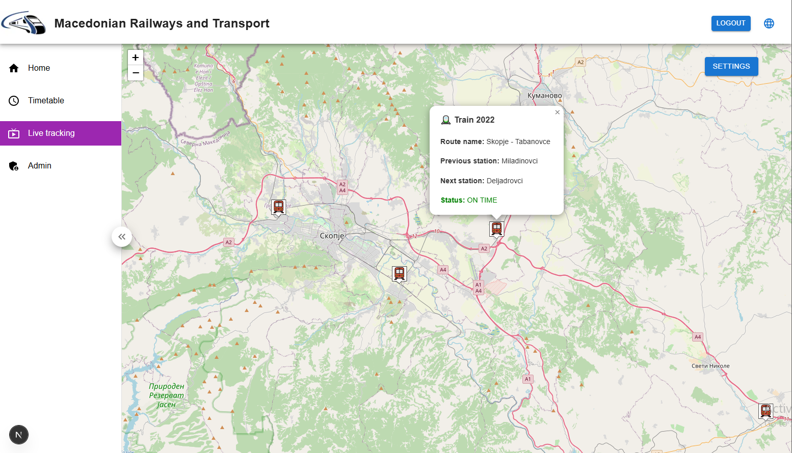
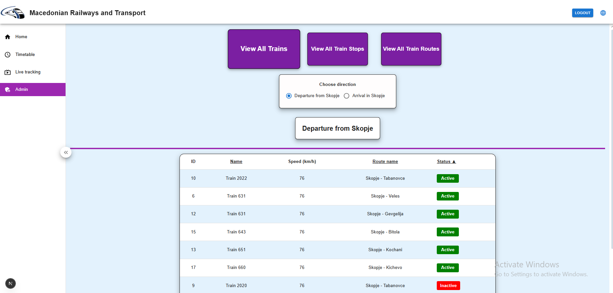
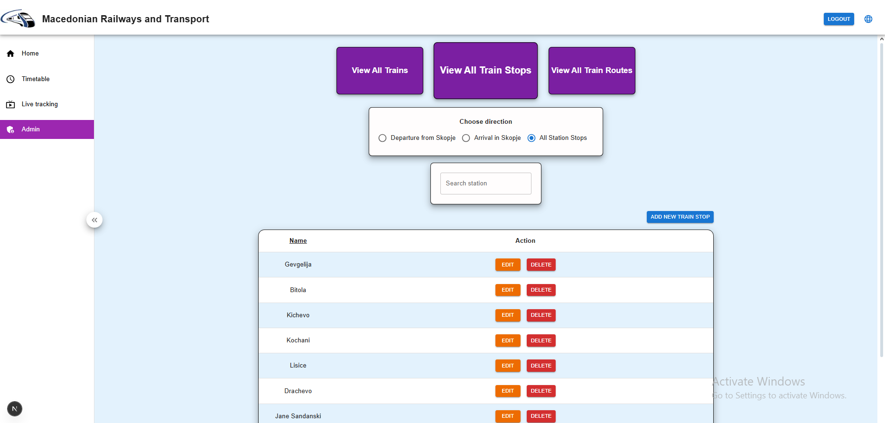
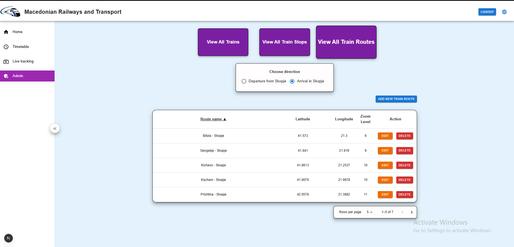

# TrainLine-On-The-Go – Bachelor's Degree Project

### 📝 About
TrainLine-On-The-Go is a web application that provides
a live simulation of train movements across Macedonia,
based on the official timetable from Macedonian Railways.

### 🏆 Achievement
I made the decision to solve this issue in order to assist
train travelers in more effectively planning their trips in
simulated environment. Users can stay on time and make
well-informed travel decisions thanks to the app's real-time
train schedules.

### 🎬 Preview(demo-video): [Demo video](https://www.youtube.com/watch?v=3KODmRduSUc)
### 🖼️ Preview(images):

### 💻 Tech stack:

- Frontend: Next ts
- Backend: Spring boot
- Authentication & Authorization: Jwt Tokens
- Database: PostgreSQL

